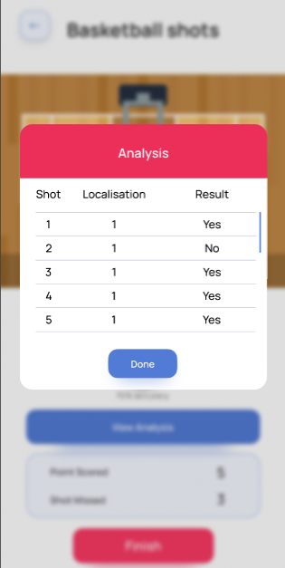

# Basketball Game Activity - AI Sports Analysis

This repository showcases the work I did on real-time basketball analysis as part of a sports tracking app. Below is the breakdown of the activity, including video demonstrations, result images, and the techniques used during development.

## Project Overview

This project involves real-time basketball analysis, where users can record a video of their basketball game, and the app provides detailed analysis using computer vision techniques. The process is explained in several steps:

1. **Video Recording & Upload**
    - Users record a basketball game live through the app.
    - The video is uploaded to our server hosted on an AWS EC2 instance.
    - FastAPI is used to handle video uploads efficiently.
    - 
    - 
    - 

2. **Ball Detection & Human Pose Estimation**
    - After the video is received, computer vision algorithms are used to detect the basketball and estimate player poses.
    - Custom model weights are applied for both ball detection and pose estimation, trained using data on [Roboflow](https://universe.roboflow.com/inplayin/basketball-hoop-detection).
    - You can view the Roboflow model [here](https://universe.roboflow.com/inplayin/basketball-hoop-detection).


3. **Ball Tracking and Shot Classification**
    - The algorithm tracks the ball trajectory during the video and detects when the ball enters the hoop.
    - It determines whether the shot was successful and classifies it based on trajectory and hoop region.
    - The analysis classifies shots into categories such as:
        - **Made Shot**
        - **Missed Shot**
    - 
    - 

4. **Result Output**
    - The system returns the number of successful and missed shots, along with the overall shooting accuracy.
    - The result is sent back to the app and displayed to the user in real-time.
    - 

## Key Components

- **Backend**: FastAPI server deployed on AWS EC2 for handling video uploads.
- **Computer Vision**: Using OpenCV, custom-trained YOLO model, and other libraries for real-time basketball analysis.
- **Tracking Algorithm**: Used to analyze the ball's trajectory and shot success by tracking its path and checking if it intersects the hoop.

## Result Analysis
- The algorithm calculates metrics such as:
  - **Points Scored**: Number of successful shots.
  - **Points Missed**: Number of missed shots.
  - **Accuracy**: Percentage of successful shots out of total shots.

- Example output from the algorithm:
    ```json
    {
      "points_scored": 7,
      "points_missed": 3,
      "accuracy": 70,
      "points_list": [
        {"shots": 1, "id": "Region_1"},
        {"shots": 0, "id": "Region_2"},
        {"shots": 1, "id": "Region_3"}
      ]
    }
    ```

## References
- [YOLOv5 Object Detection](https://github.com/ultralytics/) for ball detection.
- [AWS EC2 for Hosting](https://aws.amazon.com/ec2/)
- [OpenCV for Image Processing](https://opencv.org/)

## Future Work
- Expanding the system to detect complex game activities, such as passes and rebounds.
- Fine-tuning the model weights for even more accurate detection in varying lighting and gameplay conditions.

## Contact
For any questions or collaboration opportunities, feel free to reach out via email: deshiksingamsetty@gmail.com.
