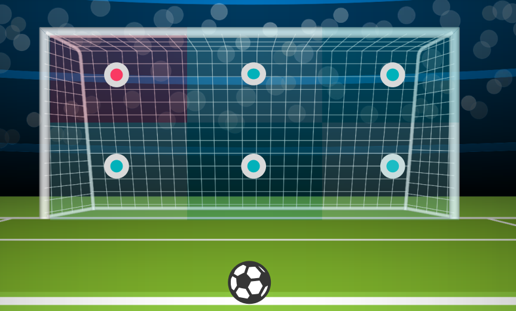

# Football Game Activity - AI Sports Analysis

This repository showcases the work I did on real-time football analysis as part of a sports tracking app. Below is the breakdown of the activity, including video demonstrations and results of model predictions, as well as references to the techniques I used during the development.

## Project Overview

This project involves real-time sports tracking where users can record a video of their football game, and the app provides detailed analysis using computer vision techniques. The process can be broken down into several steps:

1. **Video Recording & Upload**
    - Users record a football game live through the app.
    - The video is uploaded to our server hosted on an AWS EC2 instance.
    - We use FastAPI to handle video uploads efficiently.
    - [Video Demonstration of Upload](FastAPI.mp4)

2. **Ball Detection & Human Pose Estimation**
    - Once the video is received, we run computer vision algorithms to detect the ball and estimate player poses.
    - Custom model weights are used for both ball detection and human pose estimation.
    - [Video Demonstration of Ball and Pose Detection](ball_det.mp4)

3. **Ball Tracking and Goal Localization**
    - The algorithm tracks the ball during the video and identifies the frame where the ball is at the same depth(with respect to camera) as the goalpost.
    - We also detect the goalpost by training a model on a manually collected and annotated dataset using [Roboflow](https://universe.roboflow.com/inplayin/football-goalpost).
    - [Video Demonstration of Goalpost Detection](Football/Football Goalpost.mp4)
    - The ball’s location is determined, and we classify the goal into one of seven sections:
        - **No Goal**
        - **Left Top**
        - **Left Bottom**
        - **Center Top**
        - **Center Bottom**
        - **Right Top**
        - **Right Bottom**
    - The classification result is returned to the app for display.
    - 

4. **Output to User**
    - This result is displayed to the user on the app's dashboard using real-time API responses.
    - 

## Key Components

- **Backend**: FastAPI server deployed on AWS EC2 for handling video uploads.
- **Model Weights**: Custom-trained models for ball detection and human pose estimation.
- **Computer Vision**: Using OpenCV, YOLOv8, and other libraries to perform real-time analysis.
- **Classification Algorithm**: Determines goal location based on ball tracking and goalpost depth.

**References**:
- [YOLOv8 Object Detection](https://github.com/ultralytics/ultralytics) for ball detection.    
- [OpenPose](https://github.com/open-mmlab/mmpose) for human pose estimation.
- [AWS EC2 for Hosting](https://aws.amazon.com/ec2/)
- [OpenCV for Image Processing](https://opencv.org/)

## Future Work
- Expanding this system to cover other sports activities.
- Fine-tuning the model weights for better accuracy in real-time scenarios.

## Contact
For any questions or collaboration opportunities, feel free to reach out via email: deshiksingamsetty@gmail.com.
