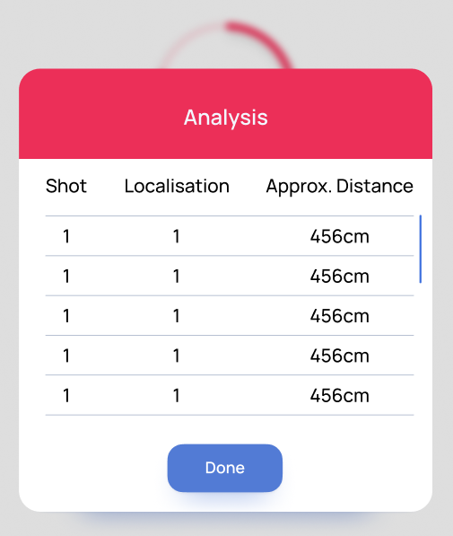
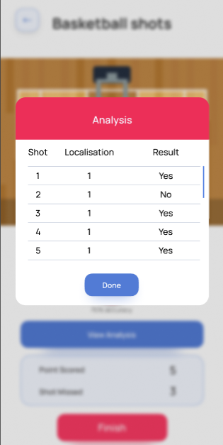

# AI Sports Analysis - Activity Tracking App

This repository contains the work I did on real-time sports analysis for an AI-based sports tracking app. The app allows users to upload videos of sports activities, and it analyzes them using custom-trained models for detecting and tracking key elements of each activity.

The project involves activities like football, basketball, dance, and guitar. Each folder in this repository contains a detailed breakdown of the techniques used, along with example outputs and results.

> **Note**: Due to the Non-Disclosure Agreement (NDA) in place, I am unable to share the code or model weights used in this project. However, I am showcasing results, images, and a high-level overview of the work completed.

## Repository Structure

- **football/**: Contains all the resources related to the football activity analysis, including ball tracking, goal localization, and results classification. The results of the analysis are returned to the app in real-time.
- **basketball/**: Contains resources for analyzing basketball shots, including ball tracking and shot classification (made or missed shots). Detailed result analysis is provided for accuracy and shot success.

Each folder has its own `README.md` file, which describes the respective activity in more detail, including images and results.

## Key Components

The project uses the following technologies:

- **FastAPI**: Handles the upload of videos, audio, and images, as well as managing requests for analyzing different activities.
- **AWS EC2**: Hosts the FastAPI backend to process videos in real-time.
- **Custom Models**: Each activity (football, basketball, dance, guitar) is processed using custom-trained models built with frameworks like YOLO and OpenCV.
- **Result Analysis**: The app provides real-time feedback on user performance, such as accuracy, points scored, and detailed shot-by-shot analysis for each activity.

## Project Workflow

1. **Video Upload**: Users upload their recorded videos to the server using the app. FastAPI handles the upload, ensuring the video is processed securely.
   -  

2. **Activity Detection**:
   - **Football**: Detects and tracks the ball during the video, identifies goal attempts, and classifies goals into different sections (e.g., left top, right bottom). Outputs accuracy, goal count, and detailed classification.
   - **Basketball**: Tracks the basketball's trajectory and determines if the shot was successful or missed. Provides feedback on shooting accuracy and points scored.
   - **Dance & Guitar**: Compares user performance against reference data (e.g., dance movements or guitar audio) and provides a performance score.
   
   - Example image for football goal classification:
     

3. **Real-Time Result Output**: After processing, the results are returned to the user via the app. Results include performance metrics like accuracy, points scored, and detailed analysis of each shot or activity.
   - Example result output for basketball shots:
     

## How It Works

The project uses several key functions for analyzing videos:
- **footballAnalyzer()**: Analyzes football games, tracks the ball, and classifies goals.
- **basketballAnalyzer()**: Tracks basketball shots and classifies them as made or missed.
- **danceAnalyzer()**: Compares user dance videos against reference videos.
- **guitarAnalyzer()**: Analyzes guitar audio and compares user performance against reference audio.

Each function processes the uploaded video or audio and returns a result in JSON format, which is then displayed to the user in the app.

## Technologies Used

- **FastAPI**: For handling API requests, file uploads, and video processing.
- **YOLOv5**: For object detection, used in tracking balls and players.
- **OpenCV**: For image processing and tracking trajectories.
- **AWS EC2**: For hosting and processing videos in the cloud.
- **Custom Trained Models**: For detecting and classifying objects and actions in the videos.

## Future Work

- Expand the system to cover more complex activities, such as team sports, or introduce multi-step action analysis (e.g., dribbling in basketball, passing in football).
- Improve model accuracy and performance, especially in real-time analysis with variable lighting conditions and camera angles.

## Contact

For any inquiries, collaborations, or further details about this project, feel free to reach out via email: **deshiksingamsetty@gmail.com**.

---

Make sure to explore the individual folders (`football/` and `basketball/`) for more details on each activity's analysis.
